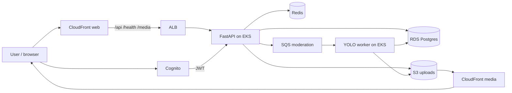

# FreshEats

Social recipe app with **food-only YOLO moderation** on upload.

**Beta is live:** [https://d1reqap9sj9n0b.cloudfront.net](https://d1reqap9sj9n0b.cloudfront.net)

No local Docker / Compose build is required — open the link above.

**Snapshot:** `v9.0.0` on `main` · signup capped at **5 users**

## Demo focus

Uploaded photos are moderated before publish:

- Food / dish photos can publish to the grid
- Non-food images are rejected with a clear **“Not a food image — …”** error
- On AWS, the client waits for the SQS → YOLO worker result before showing success or failure

## Tech stack

| Layer | Stack |
|-------|--------|
| Client | Expo / React Native / React Native Web, Expo Router, TypeScript |
| Auth | Amazon Cognito (JWT) |
| API | FastAPI, Uvicorn, Pydantic, boto3 |
| Moderation | YOLOv8 (Ultralytics), OpenCV, SQS worker |
| Data | RDS PostgreSQL, ElastiCache Redis |
| Storage / CDN | S3, CloudFront (web + media) |
| Compute | EKS (`fresheats-api`, `fresheats-worker`), ALB, ECR |
| IaC / ops | Terraform, CloudWatch, AWS Budgets → SNS → cutoff Lambda |
| Local demo | Docker Compose (optional) |

## Architecture

Live AWS beta (request + food-only moderation path):

Upload gate: create recipe → presigned S3 PUT → confirm-upload → SQS → YOLO → publish or **Not a food image** reject.

## Docs

| Doc | What it’s for |
|-----|----------------|
| [docs/README.md](docs/README.md) | Full product & infrastructure **specification / roadmap** |
| [docs/AWS.md](docs/AWS.md) | Live AWS beta ops (EKS, Cognito, dashboards, cost guardrails) |
| [infrastructure/README.md](infrastructure/README.md) | Terraform / Kubernetes layout |
