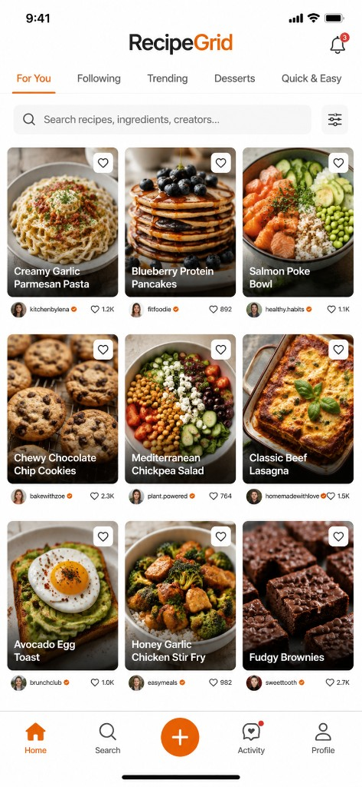

# RecipeBoard

**RecipeBoard** is a cross-platform, image-first recipe sharing app. Users sign up, upload dish photos, browse a responsive grid, like and comment, and every uploaded image is moderated with **YOLOv8** before it goes live — with uncertain cases routed to a human review queue.

Built as a working end-to-end MVP (not mockups), with a path to production on **AWS EKS** and progressive **budget / cost scaling** guardrails.

---

## Tech stack

| Layer | Technology |
|-------|------------|
| Mobile / Web | React Native, Expo, TypeScript, React Native Web |
| API | FastAPI, Uvicorn, Pydantic, JWT |
| Auth (local demo) | Placeholder JWT session |
| Auth (AWS) | Amazon Cognito (JWKS-validated access tokens) |
| Data (local) | In-memory store / Docker Postgres |
| Data (AWS) | Amazon RDS PostgreSQL 16 |
| Images (AWS) | S3 (presigned PUT) + CloudFront |
| Moderation queue (AWS) | Amazon SQS + DLQ |
| AI moderation | YOLOv8 (`ultralytics`) + food/cooking rules engine |
| Admin | Next.js, Tailwind CSS |
| Orchestration | Docker Compose (local), Terraform + EKS (AWS) |
| CI/CD | GitHub Actions (OIDC → Terraform → ECR → kubectl) |

---

## Architecture

```
Expo (RN + Web) ──JWT──▶ FastAPI
                           │
                           ├─▶ Cognito / Postgres (RDS)
                           ├─▶ S3 + CloudFront (recipe images)
                           └─▶ SQS ──▶ YOLO worker
                                        │
                                        ├─ publish (food detected)
                                        ├─ reject (unrelated / prohibited)
                                        └─ pending_review → Admin dashboard
```

**Local demo path:** placeholder auth + in-memory recipes; uploads can auto-publish or hit a local YOLO worker over HTTP.

**AWS path:** Cognito JWT → API creates recipe + presigned S3 URL → client uploads → `confirm-upload` enqueues SQS → worker downloads from S3, runs YOLO food rules, writes `moderation_jobs` / `recipes.status` / `review_queue`.

### Core tables

`profiles` · `recipes` · `recipe_images` · `likes` · `comments` · `moderation_jobs` · `review_queue`

### App screens

Sign Up · Log In · Recipe Grid · Upload Recipe · Recipe Details · User Profile

Grid cards show: **image · title · username · like count · comment count** (2 columns on mobile, more on larger screens).

---

## YOLO image moderation

Every uploaded recipe photo is analyzed before publishing:

1. **YOLOv8** detects objects in the image (COCO food / utensil / dining context classes).
2. A **rules engine** maps detections to outcomes:
   - Clear **food / cooking** signals → **publish**
   - Clearly **unrelated** dominant objects (vehicles, sports gear, etc.) with no food → **reject**
   - **Uncertain** scenes (e.g. person + kitchen context, no clear dish) → **`pending_review`**
3. Prohibited / high-risk moderation scores can reject or flag independently.
4. The **Next.js admin dashboard** lets reviewers approve or reject queued items.

Workers expose both:
- HTTP `/analyze-path` for local Docker demos
- `python -m app.sqs_consumer` for AWS SQS long-polling

---

## AWS deployment (EKS)

Infrastructure lives under `infrastructure/terraform/` and `infrastructure/kubernetes/`:

| Concern | Service |
|---------|---------|
| Compute | EKS (API, YOLO worker, admin) |
| Auth | Cognito User Pool |
| Database | RDS PostgreSQL (Multi-AZ) |
| Storage / CDN | S3 + CloudFront OAC |
| Queue | SQS moderation + DLQ |
| Cache | ElastiCache Redis |
| Images | ECR |
| IAM | IRSA for API / worker |
| Deploy | GitHub Actions OIDC |

See [docs/AWS.md](docs/AWS.md) for apply steps, env matrices, and upload flow.

---

## Phase 1 — budget alerts & shutoff

RecipeBoard ships cost guardrails so a demo / interview environment does not run away on AWS spend.

Default monthly budget: **$100**.

| Phase | Threshold | Action |
|-------|-----------|--------|
| **Phase 1** | **50%** ($50) | SNS **email alert** only |
| **Phase 2** | **70%** ($70) | **Scale** EKS node groups down to a minimal footprint (`desired=1`) |
| **Phase 1 / 2** | **80%** ($80) | **Shutoff** — EKS → 0 nodes, delete ElastiCache, stop/tag RDS |

Implemented in `infrastructure/terraform/modules/cost_guardrails/` (AWS Budgets → SNS → Lambda).

Configure:

```hcl
budget_limit_usd    = 100
budget_alert_emails = ["you@example.com"]
```

Budgets report with a delay (hours), not to-the-penny realtime. Multi-AZ RDS cannot be API-stopped; the Lambda tags it for manual follow-up. Object storage and Cognito data are retained.

---

## Quick start (demo)

```bash
cp .env.example .env

# API
cd backend && python3 -m venv .venv && source .venv/bin/activate
pip install -r requirements.txt
uvicorn app.main:app --reload --port 8000

# App
cd apps/mobile && npm install && npx expo start --web

# Admin
cd apps/admin && npm install && npm run dev
```

Demo login: any email/password when `USE_PLACEHOLDERS=true`.

---

## Project layout

```
apps/mobile/                  Expo app (grid, upload, details, profile, Cognito)
apps/admin/                   Moderation dashboard
backend/                      FastAPI + Cognito/S3/SQS/RDS adapters
workers/                      YOLO HTTP server + SQS consumer
infrastructure/terraform/     VPC, EKS, RDS, S3, CDN, SQS, Cognito, cost guardrails
infrastructure/kubernetes/    Deployments, HPA, Ingress
infrastructure/sql/           AWS Postgres schema
docs/AWS.md                   Deploy guide
screenshots/                  Demo UI
```

---

## Content & Safety Disclaimer

RecipeBoard uses automated moderation (including YOLO-based image analysis) and human review to help identify and remove inappropriate or unsafe content. However, no moderation system is perfect, and we cannot guarantee that all user-generated content will be accurate, appropriate, safe, or reviewed before it appears.

Recipes, ingredients, nutrition claims, cooking techniques, equipment guidance, and other information shared by users are provided for general informational purposes only and should not be considered professional medical, dietary, or food-safety advice. Users prepare and consume food, try recipes, and use kitchen equipment at their own risk.

RecipeBoard does not endorse or assume responsibility for user-generated content or for injuries, illness, losses, or damages resulting from reliance on or participation in such content. Follow safe food-handling practices, account for allergies and dietary restrictions, and seek appropriate professional guidance when necessary.

Users can report content they believe violates our Community Guidelines for further review.
