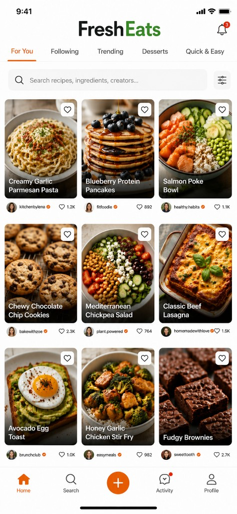

# Build FreshEats: End-to-End Social Recipe and Grocery Platform

**Beta is live:** [https://d1reqap9sj9n0b.cloudfront.net](https://d1reqap9sj9n0b.cloudfront.net)

No local Docker / Compose build is required to use the beta — open the CloudFront URL above.

### Tech stack (live beta)

| Layer | Stack |
|-------|--------|
| Client | Expo / React Native / React Native Web, Expo Router, TypeScript |
| Auth | Amazon Cognito (JWT) |
| API | FastAPI, Uvicorn, Pydantic, boto3 |
| Moderation | YOLOv8 (Ultralytics), OpenCV, SQS consumer worker |
| Data | RDS PostgreSQL, ElastiCache Redis |
| Storage / CDN | S3, CloudFront (web + media) |
| Compute | EKS (`fresheats-api`, `fresheats-worker`), ALB, ECR |
| IaC / ops | Terraform, CloudWatch, AWS Budgets → SNS → cutoff Lambda |
| Local demo | Docker Compose, MinIO / LocalStack path (optional) |

## Current status (read this first)

**Not all features in this document are implemented.**

Treat the sections below as the full product and infrastructure **specification / roadmap**, not a claim that every item is built, tested, or deployed.

**Snapshot:** `v9.0.0` on `main`.

| Mode | Status |
|------|--------|
| **Local demo** (Stage 1) | Docker Compose + Expo; `USE_PLACEHOLDERS=true`; food-only YOLO on upload |
| **Live AWS beta** (Stage 2–style) | API + YOLO worker on **EKS** (`fresheats` namespace); Cognito auth; S3 / SQS / RDS / Redis; signup capped at **`MAX_USERS=5`**; web via CloudFront |

### What the demo focuses on

The main feature for demo purposes is:

**YOLO moderation — food content only**

- Uploaded recipe photos are checked before publish
- Clear food / dish content can publish
- Non-food images (people, devices, blank frames, unrelated objects, etc.) are rejected
- Rejected uploads show a clear **“Not a food image — …”** error (reason from YOLO + upload UI)
- On AWS, the client waits for SQS/worker moderation to finish before showing publish vs reject
- Rule outcomes are shown in the upload and recipe UI

### Live beta (what is running on AWS)

- EKS deployments: `fresheats-api`, `fresheats-worker` (images in ECR)
- Auth: Cognito user pool + app client; Sign up / Log in in the Expo UI
- Password policy: **8+ characters**, upper, lower, and a number (API + signup hint)
- Hard cap: **5 total user creations** (`MAX_USERS`, `/api/v1/auth/register` + signup screen)
- Web app: Expo static export on S3 + CloudFront (`https://d1reqap9sj9n0b.cloudfront.net`), API proxied over HTTPS
- Platform: RDS Postgres, S3, SQS moderation queue, ElastiCache Redis, CloudFront (media CDN)
- Observability: CloudWatch dashboards `fresheats-platform` and `fresheats-cost-guardrails`
- Cost guardrails: AWS Budgets → SNS → cutoff Lambda (progressive scale / shutoff)

Point the mobile/web client at the CloudFront origin + Cognito when not in placeholder mode. See [docs/AWS.md](docs/AWS.md).

Other capabilities in this README (grocery lists, retailer prices, invitation codes, Helm/GitHub Actions cutover, live ads, etc.) remain planned or partial unless marked implemented elsewhere.

---

Build a production-style full-stack application named **FreshEats**. FreshEats is a social recipe and grocery-shopping platform where users share recipes, enter structured ingredients, identify where ingredients can be purchased, compare brands and user-submitted prices, create shopping lists, and interact through likes, saves, comments, follows, and reviews.

The project is intended to be an interview-ready DevOps, cloud-platform, backend, DevSecOps, and full-stack portfolio project.

### Spec / roadmap feature areas

- Secure user authentication and authorization
- Structured recipe and ingredient data
- Store, brand, and price comparisons
- Personal shopping lists
- Secure image uploads
- AI-assisted image and text moderation
- Human-review workflow
- AWS cloud infrastructure
- Terraform, EKS, Helm, and GitHub Actions
- Automated testing and observability
- Cost controls
- Placeholder advertising
- Controlled beta access
- Documented scaling and revenue roadmap

Build the application incrementally. Do not attempt to implement the large-scale roadmap before completing and testing the private and beta versions.

---

## 1. Launch strategy

### Stage 1: Private development

- Only the developer can access the application
- Run the platform through Docker Compose
- Use local PostgreSQL, Redis, and MinIO
- Use mocked moderation results where necessary
- Use placeholder advertisements only
- Do not enable unrestricted registration
- Complete the core application, tests, documentation, and deployment automation

### Stage 2: Invitation-only interview beta

- Host FreshEats for a small trusted tester set
- **Implemented now:** Cognito signup with a hard **`MAX_USERS=5`** cap (UI + API), EKS API/worker, CloudWatch dashboards
- **Still roadmap:** administrator-generated invitation codes, upload kill switches, waitlist UX polish
- Limit image uploads
- Use placeholder ads without a live advertising network
- Collect operational metrics without collecting unnecessary personal data
- Demonstrate the complete application and infrastructure during interviews

### Stage 3: Production-style interview environment

- Provision AWS infrastructure through Terraform
- Deploy the application to EKS through Helm
- Build and publish Docker images through GitHub Actions and ECR
- Demonstrate ALB, HPA, RDS, Redis, S3, SQS, CloudFront, CloudWatch, rollback, security controls, and cost guardrails
- Allow the EKS environment to be created temporarily and destroyed after demonstrations
- Never fabricate deployment, scaling, or load-test results

### Stage 4: Documented growth roadmap

Document potential evolution through:

- 100–10,000 monthly active users
- 10,000–100,000 monthly active users
- 100,000–1,000,000 monthly active users
- More than 1,000,000 monthly active users

These are planning scenarios, not claims of tested capacity.

---

## 2. Technology stack

| Area | Technology |
|------|------------|
| Frontend | Next.js, TypeScript, Tailwind CSS |
| Backend | FastAPI, Python, Pydantic |
| Database | PostgreSQL |
| ORM / migrations | SQLAlchemy, Alembic |
| Cache / rate limiting | Redis |
| Local image storage | MinIO |
| Production image storage | Amazon S3 |
| Production auth | Amazon Cognito |
| Local auth | Secure JWT-based development provider |
| Background jobs | Amazon SQS-compatible worker architecture |
| Local AWS emulation | LocalStack where practical |
| Image processing | Pillow |
| Image moderation | YOLO plus configurable image-safety classifier |
| OCR | Configurable OCR adapter |
| Backend testing | Pytest, HTTPX |
| Frontend testing | Vitest, React Testing Library |
| End-to-end testing | Playwright |
| Load testing | k6 |
| Local development | Docker Compose |
| Containers | Docker |
| Registry | Amazon ECR |
| Kubernetes | Amazon EKS |
| Packaging | Helm |
| Infrastructure | Terraform |
| CI/CD | GitHub Actions |
| Observability | OpenTelemetry, structured logs, CloudWatch |
| Security scanning | CodeQL, Trivy, Checkov, TFLint, secret scanning |

---

## 3. Repository structure

```text
fresheats/
├── apps/
│   ├── web/
│   └── admin/
├── services/
│   ├── api/
│   ├── moderation-worker/
│   ├── image-worker/
│   └── notification-worker/
├── packages/
│   └── shared-types/
├── infrastructure/
│   ├── terraform/
│   │   ├── modules/
│   │   └── environments/
│   │       ├── staging/
│   │       ├── beta/
│   │       └── production/
│   └── helm/
├── tests/
│   ├── integration/
│   ├── e2e/
│   ├── load/
│   └── fixtures/
├── docs/
├── scripts/
├── docker-compose.yml
├── .env.example
└── README.md
```

Never commit credentials, tokens, actual environment files, private images, or presigned URLs.

> **Note:** This repository currently uses a closely related layout (`apps/mobile`, `apps/admin`, `backend/`, `workers/`, `infrastructure/`). Align structure toward the target monorepo above as phases advance.

---

## 4. Authentication and profiles

Users must be able to:

- Register with email, username, and password
- Verify their email
- Sign in and sign out
- Reset their password
- View and update their profile
- Upload a moderated profile picture
- Add a biography
- Add cooking interests
- Add optional dietary preferences
- Follow and unfollow users
- Block and report users
- View another user’s approved recipes
- Delete their account

**Roles:** `user` · `moderator` · `admin`

**Authorization requirements:**

- Users may modify only their own profiles, recipes, reviews, comments, and lists
- Moderators may access only assigned review cases
- Administrators may manage users, invitation codes, feature flags, policies, and beta limits
- Never trust a user ID or role submitted by the client
- Derive identity and authorization from a verified JWT
- Record privileged actions in audit logs
- Require MFA-ready authentication for moderators and administrators

---

## 5. Recipe system

Users must be able to create, edit, archive, and delete recipes.

Each recipe supports: title, description, cover image, optional additional images, preparation / cooking / total time, serving count, difficulty, cuisine, meal type, structured ingredients, ordered preparation steps, dietary tags, allergen declarations, optional nutrition fields, source or attribution, and draft / pending / rejected / published status.

Each ingredient entry supports: name, quantity, unit, preparation note, optional group / brand / store / price / package size / product link, price-observed date, and user-entered data label.

Users must be able to browse recent and popular recipes, view followed users’ recipes, search by title or ingredient, filter by cuisine / meal type / dietary tag / preparation time, like, save, comment, report, and view author profiles.

**Only recipes in `PUBLISHED` state may appear publicly.**

---

## 6. Grocery shopping features

Implement:

- Personal shopping lists
- Add one ingredient, or all ingredients from a recipe
- Combine duplicate ingredients
- Adjust quantities based on serving count
- Check / uncheck items
- Group by grocery category (optional by store)
- Remove items / clear completed
- Multiple named lists
- Share a read-only list link through a feature flag
- Export or print a list

Do not implement automatic purchases in the first release.

---

## 7. Stores, brands, and prices

Structured support for stores, store locations, brands, products, ingredient-to-product mappings, user-submitted prices, price-observed dates, package sizes, unit-price calculations, verification status, and reports for inaccurate prices.

**Price requirements:**

- Clearly label prices as user-submitted unless provided by a verified integration
- Display the observation date
- Do not claim real-time accuracy
- Do not scrape retailers without permission
- Keep retailer API integrations behind adapters
- Normalize quantities before unit-price calculations
- Reject negative, impossible, malformed, or extreme prices
- Allow moderators to remove deceptive submissions
- Treat future shopping integrations as roadmap features

**Notice near user-submitted pricing:**

> Prices and availability may vary by store, location, and date. Verify current pricing with the retailer before purchasing.

---

## 8. Core data model

Create SQLAlchemy models, Alembic migrations, Pydantic schemas, services, repositories, and REST endpoints for:

User, Profile, InvitationCode, BetaConfiguration, Recipe, RecipeImage, RecipeStep, Ingredient, RecipeIngredient, DietaryTag, Allergen, Store, StoreLocation, Brand, Product, ProductPrice, ShoppingList, ShoppingListItem, Follow, Block, Like, Save, Comment, Notification, Report, ModerationJob, ModerationFinding, ReviewCase, ReviewDecision, Appeal, PolicyVersion, FeatureFlag, AdPlacement, MockAdEvent, AuditEvent, CostAssumption, ScalingTestResult.

Use normalized relational tables with appropriate indexes, foreign keys, uniqueness constraints, and cascading behavior.

---

## 9. Controlled beta access

Administrator controls for registration mode, invitation codes, maximum active users, per-user recipe/image quotas, max image size, kill switches (uploads, comments, prices, ads), maintenance mode, suspend users, and revoke sessions.

**Live beta (implemented):** self-serve Cognito signup gated by `MAX_USERS=5` (`GET/POST /api/v1/auth/signup-status` + `/auth/register`). Invitation codes and admin kill switches remain roadmap.

**Default beta settings (target design):**

```text
registration_mode=invite_only   # live beta currently uses open Cognito signup + MAX_USERS
maximum_active_users=5
recipes_per_user=20
images_per_recipe=5
maximum_image_size_mb=10
advertising_provider=mock
live_advertising_enabled=false
```

All limits must be configurable. When the maximum-user limit is reached, display a waitlist or closed-beta message.

---

## 10. Secure image-upload flow

1. Authenticated client submits expected image metadata  
2. API checks account status, ownership, quota, file type, and expected size  
3. API generates a random object key  
4. API creates a `PENDING_UPLOAD` image record  
5. API generates a short-lived presigned upload URL for the exact object key  
6. Client uploads directly into a private S3 or MinIO quarantine bucket  
7. An event starts image validation  
8. System verifies the actual file signature  
9. System safely decodes the image  
10. System strips metadata, including location information  
11. System creates normalized image derivatives  
12. System sends a moderation job to the queue  
13. Approved images are promoted to published-media storage  
14. Failed, rejected, or uncertain images remain private  

**Security requirements:** S3 Block Public Access, KMS encryption in production, HTTPS everywhere, short-lived presigned URLs, server-generated object keys, file signature verification, size/dimension limits, safe decoding, metadata removal, separate quarantine and published buckets, no public URL before approval, no raw images or presigned URLs in logs.

---

## 11. AI-assisted moderation

Analyze recipe images, profile images, titles, descriptions, preparation steps, comments, product reviews, and visible text detected through OCR.

For images: safely decode, remove metadata, run YOLO for object detection, run an image-safety classifier, perform OCR, moderate detected text, generate a perceptual hash, compare against previously rejected content, and store labels, confidence scores, model versions, and policy versions.

**YOLO is an object detector.** Do not claim that YOLO independently guarantees content safety. Use separate components for object detection, image-safety classification, OCR, text classification, policy decision-making, and human review.

**Demo mode (private development):** the working demonstration emphasizes **food-only** YOLO moderation for recipe photos. Full multi-classifier / OCR / safety pipelines in this section remain part of the target design.

---

## 12. Moderation states and fail-closed behavior

**Image states:** `PENDING_UPLOAD` · `QUARANTINED` · `VALIDATING` · `SCANNING` · `NEEDS_REVIEW` · `APPROVED` · `REJECTED` · `PROCESSING_FAILED` · `DELETED`

**Recipe states:** `DRAFT` · `PENDING_MODERATION` · `NEEDS_REVIEW` · `PUBLISHED` · `REJECTED` · `ARCHIVED` · `DELETED`

The system must **fail closed**. Never publish when moderation is incomplete, a required classifier fails, a worker crashes, processing times out, the database is unavailable, results conflict, the image is malformed, confidence is insufficient, or human review is pending.

Enforce publication rules in state-transition services, feed/search/profile queries, notification logic, published-media promotion, S3 boundaries, CloudFront configuration, and API filtering. Do not rely solely on the frontend.

---

## 13. Human-review dashboard

Protected Next.js administrative dashboard with secure moderator login, assigned review queue, blurred thumbnails by default, content warnings, deliberate reveal control, findings and confidence scores, approve / reject / escalate, required reason codes, reviewer notes, appeals queue, audit history, and policy/threshold management for administrators.

Use optimistic locking (or equivalent) so two reviewers cannot finalize the same case inconsistently. Use harmless fixtures and mocked prohibited-content findings during testing. Do not place disturbing or illegal content in the repository.

---

## 14. Food-safety and health disclaimers

**General disclaimer:**

> Recipes, dietary labels, allergen information, nutrition details, prices, and product information on FreshEats may be submitted by users and may contain errors. FreshEats does not provide medical, nutritional, or food-safety advice. Verify ingredients, allergens, preparation temperatures, storage requirements, and dietary suitability before preparing or consuming a recipe.

**Allergen warning:**

> Always check product labels and ingredients. User-submitted allergen and dietary information is not guaranteed to be complete or accurate.

**Pricing notice:**

> Prices and availability may vary by store, location, and date. Verify current pricing with the retailer before purchasing.

**Upload notice:**

> Uploaded images remain private while safety checks are completed. Do not upload graphic, explicit, illegal, or non-consensual content.

Create development-template pages for Community Guidelines, Privacy Policy, Terms of Service, Copyright and takedown, Appeals, Data retention, Food-safety, Allergen, and Pricing/affiliate disclosure. Clearly mark templates as requiring qualified legal review before public release.

---

## 15. Privacy and retention

Implement configurable rules to delete temporary processing files, retain moderation findings only as long as operationally necessary, delete rejected images after the appeal window, support account deletion, remove or anonymize personal information, strip location metadata, log retention/deletion events, support legal-hold status, avoid logging raw private content / credentials / presigned URLs, and collect only necessary information.

---

## 16. Placeholder advertising

Implement advertising-ready UI without a live advertising network: `AdProvider` interface, `MockAdProvider`, native feed / banner / recipe-detail / sponsored ingredient / brand / product cards, and a global advertising feature flag.

Clearly label “Advertisement” or “Sponsored.” Do not disguise ads as recipes. Do not show ads in the moderation dashboard. Use harmless local placeholder assets. Do not include real advertising SDKs, third-party tracking, or represent placeholder activity as revenue. Keep live advertising disabled by default.

Record simulated ad request / impression / click events marked as test data. Document extension points for display ads, sponsored products/brands, affiliate links, premium/ad-free, and retail integrations. Do not implement live ads, affiliate tracking, payments, or purchases in the private beta.

---

## 17. Revenue-estimation model

Configurable administrator revenue-estimation page:

```text
estimated_monthly_revenue =
  monthly_active_users × impressions_per_user_per_month ÷ 1000 × estimated_RPM
```

Default illustrative assumptions: `impressions_per_user_per_month=60`, low/medium/high RPM = `$1` / `$3` / `$6`.

| Monthly active users | Monthly impressions | $1 RPM | $3 RPM | $6 RPM |
|----------------------|---------------------|--------|--------|--------|
| 100 | 6,000 | $6 | $18 | $36 |
| 1,000 | 60,000 | $60 | $180 | $360 |
| 10,000 | 600,000 | $600 | $1,800 | $3,600 |
| 100,000 | 6,000,000 | $6,000 | $18,000 | $36,000 |
| 1,000,000 | 60,000,000 | $60,000 | $180,000 | $360,000 |

These are hypothetical scenarios, not forecasts. Placeholder impressions produce no revenue. Keep estimated revenue separate from actual revenue. Also estimate revenue/cost per active user, gross margin, break-even user count, and storage/moderation cost per image.

---

## 18. Local architecture

Docker Compose:

```text
Next.js frontend → FastAPI → PostgreSQL → Redis → MinIO quarantine
  → LocalStack queue → image/moderation worker → Next.js admin dashboard
```

Provide one-command startup, health checks, migrations, seeded developer/moderator accounts, safe sample recipes, mock prices, mock moderation outcomes, and mock advertisements.

---

## 19. AWS beta architecture

For 5–10 invited users:

```text
User → Route 53 → CloudFront + WAF → ALB/HTTPS → FastAPI
  → Cognito, PostgreSQL, Redis
  → private S3 quarantine → SQS → moderation worker
  → approved S3 media → CloudFront
```

Provision with Terraform: VPC (public / private app / isolated data), IGW, NAT, VPC endpoints, security groups, Route 53, ACM, CloudFront, WAF, Cognito, ECR, compute, RDS PostgreSQL, optional Redis, S3 quarantine / published / derivatives, SQS + DLQ, KMS, Secrets Manager, CloudWatch, CloudTrail, AWS Budgets, SNS.

For the small beta, support a cost-conscious ECS/Fargate deployment in addition to the production-style EKS environment.

---

## 20. EKS interview architecture

Independently deployable EKS: managed node groups, ALB Ingress, Pod Identity, RDS, Redis, S3, SQS, CloudFront, Route 53, WAF, CloudWatch, KMS, Secrets Manager.

Helm charts for API, web, moderation / image / notification workers, services, ingress, ConfigMaps, secret references, service accounts, HPA, queue-driven worker scaling, PDBs, NetworkPolicies, readiness / liveness / startup probes, and resource requests/limits.

Use separate least-privilege Pod Identity roles per workload. Make EKS optional so it can be created for interviews and destroyed afterward.

---

## 21. Scaling behavior

Scale according to measured workload (MAU, concurrency, RPS, uploads/min, queue depth, moderation latency, CPU, DB connections, cache hit rate, storage growth, CloudFront traffic, cost and revenue per active user).

Use HPA, queue-driven worker scaling, node autoscaling, Redis caching, connection pooling, indexes, CloudFront caching, optimized image derivatives, S3 lifecycle policies, scheduled nonproduction shutdown, and optional scale-to-zero workers.

---

## 22. Scaling roadmap

Document in `docs/scaling-roadmap.md`:

| Stage | Planning range | Approach |
|-------|----------------|----------|
| Private development | 1 developer | Docker Compose, local stack, mock ads |
| Invitation-only beta | 5–10 users | Cognito, S3, SQS, quotas, Budgets |
| Public MVP | 100–10,000 MAU | EKS, Helm, HPA, CloudFront, WAF |
| Growth | 10,000–100,000 MAU | Workload split, read replicas, search |
| Large scale | 100,000–1,000,000+ MAU | Multi-account, regional delivery, DR |

These are planning ranges, not guaranteed capacity.

---

## 23. Cost observability

Track total estimated AWS cost plus compute, database, Redis, storage, CDN/transfer, moderation, cost per active user / recipe / image, estimated advertising revenue, and estimated gross margin. Keep prices configurable. Document region and estimation date.

---

## 24. Budget guardrails

Create development, beta, and production budgets. Example beta thresholds: **50%** notify · **70%** reduce noncritical workers · **80%** disable new uploads · **90%** maintenance mode / scale down optional workloads.

Requirements: support `DRY_RUN=true`, log planned and completed actions, require explicit configuration before live actions, never publish unmoderated images, never auto-delete the production database, never delete user content outside retention policy, never disable security logging to reduce cost, and include a recovery runbook.

---

## 25. CI/CD

**Pull requests:** formatting, linting, type checking, unit/integration tests, Terraform fmt/validate, TFLint, Checkov, Helm lint, Kubernetes schema validation, CodeQL, dependency scanning, secret scanning, container scanning.

**Main branch:** test → build images → immutable tags → scan → push ECR → deploy staging → migrations → smoke / integration / e2e → production approval → rolling/canary → health verify → rollback on failure.

Use GitHub OIDC and short-lived AWS credentials.

---

## 26. Observability

Structured logs, metrics, and traces for request rate, API latency/errors, auth failures, feed/search latency, uploads, queue depth, moderation duration, approval/rejection rates, worker health, DB pressure, cache hit rate, CloudFront traffic, moderator actions, retention jobs, budget actions, and simulated ad events.

Alarms for API error spikes, queue backlog, DLQ messages, worker failure, moderation timeout, DB pressure, unexpected public S3 access, unusual admin activity, and budget thresholds.

---

## 27. Reliability and recovery

Idempotent consumers, duplicate-event protection, retries with exponential backoff, DLQs, backups, PITR documentation, health checks, rolling deploys, Helm rollback, restore testing, and an incident-response runbook.

**A moderation outage must pause publication. It must never allow unreviewed content into the public feed.**

---

## 28. Testing

Cover unit, API/integration, upload, moderation, publication, price, advertisement, infrastructure, end-to-end, and load tests as specified in the build document. Document actual load-test results. Do not claim unsupported capacity.

**E2E happy path:** invited tester → sign in → recipe draft → structured ingredients → store/price → quarantine upload → moderation → approve → publish → feed → shopping list → mock ad → audit/metrics. Also test the rejected-image path.

---

## 29. Interview demonstration

Create `docs/interview-demo.md` for a 10–15 minute demo covering product/architecture, Terraform, GitHub Actions, ECR, Kubernetes, invitation-only registration, structured recipes, ingredients/stores/prices, private upload, S3 quarantine, SQS moderation, human review, publication, feed, shopping list, placeholder ads, CloudWatch, HPA/worker scaling, budget dry run, rollback/recovery, and roadmap.

**Accurate summary:**

> FreshEats is an invitation-only social recipe and grocery-shopping platform with structured ingredient data, store and price comparisons, personal shopping lists, secure image uploads, AI-assisted moderation, and production-style AWS infrastructure managed through Terraform, EKS, Helm, and GitHub Actions.

---

## 30. Documentation

Create (and keep current):

`docs/architecture.md` · `local-development.md` · `private-deployment.md` · `beta-deployment.md` · `eks-deployment.md` · `data-model.md` · `moderation-pipeline.md` · `threat-model.md` · `testing-strategy.md` · `scaling-roadmap.md` · `revenue-model.md` · `cost-model.md` · `interview-demo.md` · `rollback-runbook.md` · `restore-runbook.md` · `incident-response.md` · `budget-guardrails.md` · `privacy-retention.md` · `food-safety.md` · `retailer-integration-roadmap.md`

Clearly distinguish implemented, tested, deployed, estimated, and future roadmap features.

---

## 31. Implementation phases

1. **Local foundation** — monorepo, Compose, Next.js, FastAPI, PostgreSQL, local auth, profiles, recipes, ingredients, feed, unit tests  
2. **Grocery features** — shopping lists, servings, stores, brands, products, prices, social actions  
3. **Secure image moderation** — quarantine, validation, YOLO/safety adapters, publication gate, human review  
4. **Private AWS staging** — Terraform, Cognito, S3, SQS, RDS, ECR, CloudWatch, KMS, Actions, budgets  
5. **Invitation-only beta** — invite codes, quotas, kill switches, HTTPS/WAF/CloudFront, placeholder ads  
6. **Production-style EKS demo** — Helm, ALB, Pod Identity, HPA, rollback, load test, cost dry run  
7. **Roadmap only** — public MVP, growth/large-scale architecture, retail APIs, live ads/affiliates, multi-account/region, DR  

---

## 32. Cursor implementation instructions

Before writing application code:

1. Generate the repository structure  
2. Create `docs/implementation-plan.md`  
3. Create the database entity-relationship diagram  
4. Create API contracts  
5. Create recipe and image state diagrams  
6. Create local, beta, and EKS architecture diagrams  
7. List environment variables  
8. Identify external dependencies  
9. Define phase acceptance criteria  
10. Identify intentionally deferred features  

Then implement **one phase at a time**. After each phase: run relevant tests, fix failures, update documentation, update the implementation-status table.

- Do not mark incomplete features as complete  
- Do not fabricate deployment, load-test, retailer-price, or advertising-revenue results  
- Do not include disturbing test images  

**Begin with Phase 1 only.** Produce working code and tests before advancing to Phase 2.
