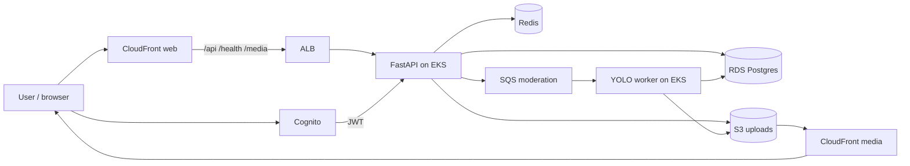

# FreshEats on AWS (EKS + full AWS)

Ops guide for the **live beta**. Product/roadmap spec: [README.md](README.md). Homepage summary: [../README.md](../README.md).

## Architecture

Live beta path (CloudFront web proxies API to the ALB):



```
Expo / RN Web ──Cognito JWT──▶ CloudFront ──▶ ALB ──▶ FastAPI (EKS)
                                                      ├─ RDS PostgreSQL
                                                      ├─ Redis
                                                      ├─ S3 (presigned PUT)
                                                      └─ SQS ──▶ YOLO worker (EKS)
CloudFront (media) ──▶ S3 recipe-images
Admin (Next.js on EKS) ──X-Admin-Secret──▶ FastAPI
```

## Tech stack

| Layer | Stack |
|-------|--------|
| Client | Expo / React Native / React Native Web, Expo Router, TypeScript |
| Auth | Amazon Cognito (JWT) |
| API | FastAPI, Uvicorn, Pydantic, boto3 |
| Moderation | YOLOv8 (Ultralytics), OpenCV, SQS worker |
| Data | RDS PostgreSQL, ElastiCache Redis |
| Storage / CDN | S3, CloudFront (web + media) |
| Compute | EKS (`fresheats-api`, `fresheats-worker`), ALB, ECR |
| IaC / ops | Terraform, CloudWatch, AWS Budgets → SNS → cutoff Lambda |

## Components

| Layer | AWS service |
|-------|-------------|
| Auth | Cognito User Pool |
| API / Admin / Worker | EKS |
| Database | RDS PostgreSQL 16 (single-AZ micro by default) |
| Images | S3 + CloudFront OAC |
| Moderation queue | SQS + DLQ |
| Cache | ElastiCache Redis |
| Images/repos | ECR |
| Secrets | Secrets Manager + K8s Secret |
| IaC | Terraform under `infrastructure/terraform/` |
| Cost guardrails | AWS Budgets ($250 default) → SNS → Lambda progressive scale/shutoff |
| Observability | CloudWatch dashboards: `fresheats-platform` (all services) + `fresheats-cost-guardrails` |

## CloudWatch dashboards

| Dashboard | Purpose |
|-----------|---------|
| **`fresheats-platform`** | Platform overview: EKS, RDS, Redis, SQS (+ DLQ), S3, CloudFront, Cognito, NAT, cost-cutoff Lambda |
| **`fresheats-cost-guardrails`** | Budget phases, cutoff Lambda logs, soft-scale / lock / shutoff |

```bash
cd infrastructure/terraform/environments/prod
terraform output -raw platform_dashboard_url
terraform output -raw cost_guardrails_dashboard_url
```

Or open: CloudWatch → Dashboards → `fresheats-platform`

Steady-state is sized so normal HPA scaling **cannot** explode spend past the node hard-cap:

| Resource | Budget-safe default |
|----------|---------------------|
| EKS nodes | `t3.medium`, desired **2**, **max 2**, min 1 |
| RDS | `db.t4g.micro`, **single-AZ**, 20 GB (stoppable at shutoff) |
| Redis | `cache.t4g.micro` × 1 |
| API HPA | 1–3 replicas |
| Worker HPA | 1–2 replicas |
| Monthly budget | **$250** (EKS control plane + NAT alone is ~$100 before app nodes) |

App pods scale with load (HPA). Node count is capped in Terraform, so more pods pack onto the same 2 nodes instead of opening a third.

## Cost guardrails (progressive — avoid crossing shutoff)

| Threshold | Action |
|-----------|--------|
| **50%** | Soft scale: EKS → **desired=1** (email via SNS) |
| **70%** | Hard lock: EKS → **desired=1, max=1** (cannot grow) |
| **80%** | Shutoff: EKS → 0, delete Redis, stop RDS |

Configure in `infrastructure/terraform/environments/prod/terraform.tfvars`:

```hcl
budget_limit_usd    = 250
budget_alert_emails = ["you@example.com"]
# optional overrides:
# alert_threshold   = 50
# scale_threshold   = 70
# shutoff_threshold = 80
```

**Limits to know:**
- AWS Budgets lag by ~hours — this is not instantaneous to-the-penny.
- Single-AZ RDS (default) can be stopped by the shutoff Lambda; Multi-AZ cannot (would only be tagged).
- S3 / Cognito / ECR data is kept (storage is cheap); only compute is burned down.
- Confirm the SNS email subscription after `terraform apply`.
- Optional: attach `deny_spend_policy_arn` to IAM users/roles to block new EC2/EKS/RDS creates after a breach.

## Test shutoff (dry-run first)

The cutoff Lambda supports plan-only mode via `DRY_RUN=true` (Terraform: `cost_guardrails_dry_run = true`). It still parses the budget threshold and returns the actions it *would* take, prefixed with `dry_run:`, without mutating EKS / RDS / Redis.

### 1. Enable dry-run

```hcl
# infrastructure/terraform/environments/prod/terraform.tfvars
cost_guardrails_dry_run = true
```

```bash
cd infrastructure/terraform/environments/prod
terraform apply -target=module.cost_guardrails
```

Or flip the env var on an already-deployed function:

```bash
aws lambda update-function-configuration \
  --function-name fresheats-cost-cutoff \
  --environment "Variables={EKS_CLUSTER_NAME=fresheats,RDS_INSTANCE_ID=...,REDIS_CLUSTER_ID=...,AWS_REGION=us-east-1,ALERT_THRESHOLD=50,SCALE_THRESHOLD=70,SHUTOFF_THRESHOLD=80,DRY_RUN=true}"
```

### 2. Invoke with a fake 80% Budgets payload

```bash
cat > /tmp/shutoff-event.json <<'EOF'
{
  "Records": [{
    "Sns": {
      "Subject": "AWS Budgets Notification",
      "Message": "{\"threshold\": 80, \"notificationType\": \"ACTUAL\"}"
    }
  }]
}
EOF

aws lambda invoke \
  --function-name fresheats-cost-cutoff \
  --cli-binary-format raw-in-base64-out \
  --payload file:///tmp/shutoff-event.json \
  /tmp/shutoff-out.json && cat /tmp/shutoff-out.json
```

Expect `"phase":"shutoff"`, `"dry_run":true`, and actions like `dry_run:eks:...->desired=0`.

Use `"threshold": 70` / `50` to exercise **lock** vs **soft_scale** without mutations either.

### 3. Turn dry-run off for real shutoff

Set `cost_guardrails_dry_run = false`, apply, then re-invoke the same payload (or wait for a real budget breach). Live mode **will** scale EKS to 0, delete Redis, and stop/tag RDS.

## Monitor scale & shutoff

Terraform creates a CloudWatch dashboard and alarms on the budget SNS topic:

| Signal | What fires |
|--------|------------|
| Soft scale / lock / shutoff | Log metric filter → alarm → SNS email |
| Lambda errors | `AWS/Lambda` Errors → SNS |
| RDS stopped | EventBridge `RDS-EVENT-0087` → SNS |
| Lambda completion | SNS publish with phase + actions JSON |

```bash
# Dashboard URL after apply
terraform output -raw cost_guardrails_dashboard_url

# Or open: CloudWatch → Dashboards → fresheats-cost-guardrails
```

After any shutoff (live or dry-run), confirm on the dashboard **Guardrail phases** widget and CLI:

```bash
aws eks describe-nodegroup --cluster-name fresheats --nodegroup-name fresheats-general \
  --query 'nodegroup.scalingConfig'
aws rds describe-db-instances --db-instance-identifier fresheats-postgres \
  --query 'DBInstances[0].DBInstanceStatus'
aws elasticache describe-cache-clusters --cache-cluster-id <redis-id>
```

Dry-run still increments **DryRunEvents** / phase metrics and emails SNS, but does not mutate EKS/RDS/Redis.

## Apply infrastructure

```bash
cd infrastructure/terraform/environments/prod
cp terraform.tfvars.example terraform.tfvars
terraform init
terraform apply
```

Capture outputs:

- `cognito_user_pool_id`, `cognito_client_id`, `cognito_issuer`
- `sqs_moderation_url`, `s3_*`, `cloudfront_domain`
- `database_url` (sensitive), `ecr_urls`, IRSA role ARNs

## Bootstrap database

```bash
psql "$DATABASE_URL" -f infrastructure/sql/001_aws_schema.sql
```

## Configure Kubernetes secrets

```bash
cp infrastructure/kubernetes/secrets.example.yaml /tmp/fresheats-secrets.yaml
# fill values from terraform output
kubectl apply -f infrastructure/kubernetes/namespace.yaml
kubectl apply -f /tmp/fresheats-secrets.yaml
# patch IRSA role ARNs + ECR image URLs in deployment YAMLs
kubectl apply -f infrastructure/kubernetes/
```

## App environment (AWS mode)

### API / worker pods

```
AUTH_PROVIDER=cognito
USE_PLACEHOLDERS=false
USE_LOCAL_YOLO=false
COGNITO_USER_POOL_ID=...
COGNITO_CLIENT_ID=...
COGNITO_ISSUER=https://cognito-idp.us-east-1.amazonaws.com/...
DATABASE_URL=postgresql://...
SQS_MODERATION_URL=https://sqs...
STORAGE_BUCKET_RAW=fresheats-raw-uploads
STORAGE_BUCKET_RECIPES=fresheats-recipe-images
CLOUDFRONT_DOMAIN=dxxxx.cloudfront.net
AWS_REGION=us-east-1
ADMIN_SECRET=...
```

### Mobile

```
EXPO_PUBLIC_USE_PLACEHOLDERS=false
EXPO_PUBLIC_USE_LOCAL_YOLO=false
EXPO_PUBLIC_API_URL=https://api.fresheats.app
EXPO_PUBLIC_COGNITO_USER_POOL_ID=...
EXPO_PUBLIC_COGNITO_CLIENT_ID=...
EXPO_PUBLIC_AWS_REGION=us-east-1
EXPO_PUBLIC_CDN_URL=https://dxxxx.cloudfront.net
```

Enable Cognito app client auth flow **USER_PASSWORD_AUTH** (Terraform already sets this).

## Upload / moderation flow (AWS)

1. `POST /api/v1/recipes` → creates recipe + `moderation_jobs` row + **presigned S3 PUT**
2. Client uploads image to S3
3. `POST /api/v1/recipes/{id}/confirm-upload` → copy to recipes bucket, enqueue SQS
4. Worker (`python -m app.sqs_consumer`) downloads image, runs YOLO food rules
5. Outcome: `published` | `rejected` | `pending_review` → admin dashboard

## CI/CD

GitHub Actions workflow: [`.github/workflows/deploy.yml`](../.github/workflows/deploy.yml)

Required secret: `AWS_DEPLOY_ROLE_ARN` (OIDC trust to this repo).

Pipeline: Terraform apply → build/push ECR (`api`, `worker`, `admin`) → `kubectl` rollout.

## Local demo vs AWS

| Mode | Flags | Auth | Storage | Moderation |
|------|-------|------|---------|------------|
| Demo | `USE_PLACEHOLDERS=true` | placeholder token | in-memory / local disk | auto-publish |
| Local YOLO | `USE_LOCAL_YOLO=true` | placeholder token | local disk | sync worker HTTP |
| AWS | `AUTH_PROVIDER=cognito` | Cognito JWT | S3 + CF | SQS + worker |

## Notes

- Replace `ACCOUNT_ID` and IRSA ARNs in Kubernetes manifests after first apply.
- Live `terraform apply` requires AWS credentials in your account — this repo ships the code, not a live deploy.
- Cognito `sub` is stored as `profiles.cognito_sub`; API maps JWT → profile UUID automatically.
